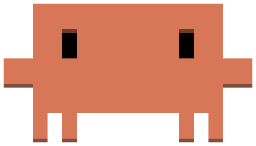

<div align="center">



# 🦀 Клодик

**Маленький пиксельный питомец-тамагочи, который живёт прямо на твоём рабочем столе.**

Всегда поверх окон, можно таскать мышкой по экрану, реагирует на то, что ты делаешь,
и по-настоящему хочет есть и скучает, если его забыть.

</div>

---

## Что это

Клодик — десктопное Electron-приложение для Linux. Это не просто картинка:
у него своя жизнь, пока ты работаешь, — он ходит по экрану, следит за тем,
на каком мониторе ты сейчас сидишь, засыпает, если ты надолго отошёл,
и ноет, если ты слишком долго не отрываешься от компьютера.

<table>
<tr>
<td width="50%" valign="top">

### 🎮 С ним можно по-настоящему взаимодействовать

- **Перетаскивать** мышкой куда угодно — хоть на панель задач, хоть поверх
  любого окна
- **Бросить** его — он плавно и реалистично улетит обратно туда, откуда
  его взяли; если бросить резко — укачает
- **Погладить** кликом, защекотать быстрыми кликами до бурной любви
- **Двойной клик** — весёлый трюк с вращением
- **Правый клик** — меню: покормить, статистика, настройки

</td>
<td width="50%" valign="top">

### 🍪 Настоящая тамагочи-механика

- Голод и настроение **реально убывают со временем**, даже пока
  приложение закрыто
- Забудешь покормить — пожалуется; покормишь — обрадуется
- Меняется само выражение глаз: злится, грустит, радуется — не просто
  текстовые реплики
- Сотни уникальных реплик: смешных, странных и неожиданно тёплых
- Следит за вторым монитором и сам приходит к месту, где ты печатаешь
- Видно на всех рабочих столах и переходит за тобой при переключении

</td>
</tr>
</table>

## 🎨 Текстурпаки

Внешность можно менять — прямо как в Minecraft. Встроены категории
**Цвета** (красный, жёлтый, зелёный, синий, фиолетовый, розовый) и
**Темы** (Майнкрафт, Лава, Золото), а ещё можно сделать свою и загрузить
как обычный `.zip`-архив — никакой сборки не нужно.

Правый клик → **Текстурка** → **Импортировать текстурпак...**

Архив должен содержать как минимум эти 5 PNG с прозрачным фоном:

```
base.png    — обычный вид
blink.png   — моргание / сон
tired.png   — устал
legs_a.png  — шаг, фаза 1
legs_b.png  — шаг, фаза 2
```

Можно добавить ещё три необязательных кадра для выражений лица
(`angry.png`, `sad.png`, `happy.png`) — если их нет, используется
`tired.png`/`base.png` как замена.

## Установка и запуск

Нужен [Node.js](https://nodejs.org/) (18+) и Linux с X11 или Wayland (через XWayland).

```bash
git clone https://github.com/Dissy-code/clodik-pet.git
cd clodik-pet
npm install
npm start
```

При первой установке `npm install` спросит разрешение на postinstall-скрипт
Electron (он просто скачивает сам движок) — подтверди:

```bash
npm install-scripts approve electron
npm install
```

## Управление

| Действие | Что происходит |
|---|---|
| Зажать ЛКМ и потащить | Поднимаешь его и несёшь куда хочешь |
| Отпустить высоко в воздухе | Плавно падает обратно на то место, откуда взяли |
| Резко дёрнуть и бросить | «Укачивает» — покружится и пожалуется |
| Клик | Погладить |
| 4+ клика подряд | Режим обожания ❤ |
| Двойной клик | Трюк — весёлое вращение |
| Правый клик | Меню: покормить, статистика, настройки, выход |

## Как он себя ведёт

- **Ходит сам по себе**, пока ты работаешь, иногда подходит к месту,
  где ты печатаешь
- **Засыпает**, если мышь не двигалась больше 10 минут
- **Волнуется и машет рукой**, если ты отошёл не так уж надолго
- **Ноет про перерыв**, если ты слишком долго без паузы сидишь за компом
  (порог настраивается в правом клике)
- **Переходит на другой монитор**, если видит, что ты туда переключился
- **Иногда сам гуляет** между мониторами, если их несколько

## Технически

- [Electron](https://www.electronjs.org/) — два крошечных окна: само
  окошко крабика (ровно по размеру спрайта) и отдельное окошко под пузырь
  речи, которое просто следует за первым
- Перетаскивание полностью ручное (mousedown/mousemove/mouseup двигают
  окно через IPC) — на части линуксовых композиторов `-webkit-app-region:
  drag` перехватывает вообще все клики на элементе, так что это надёжнее
- Вся «физика» падения и анимация — на `<canvas>`, без лишней нагрузки на CPU
- Состояние (голод, настроение, статистика) хранится локально в
  `~/.config/clodik-pet/settings.json` и считается в реальном времени,
  даже когда приложение не запущено

> **Ограничение Wayland:** приложение не умеет узнавать точные координаты
> чужих окон (это запрещено на уровне протокола безопасности Wayland) —
> поэтому Клодик не «прилипает» к конкретной строке чата физически, а просто
> остаётся там, куда его поставили, поскольку он всегда отрисовывается поверх
> всего остального.

> **KDE Plasma / KWin:** стандартный Electron-флаг «показывать на всех
> рабочих столах» на KWin+Wayland не работает. Приложение определяет это
> само и через `kwin-sticky.js` (скрипт KWin, запускается через его
> DBus-интерфейс `org.kde.KWin.Scripting`) напрямую выставляет окну
> `desktops = []` — это единственный надёжный способ закрепить окно на
> всех рабочих столах под KWin. На других окружениях (GNOME и т.д.)
> используется обычный Electron API, а смена рабочего стола определяется
> через `xdotool`.

---

<div align="center">

Сделано как маленький десктопный эксперимент для души, а не продакшен-софт. Багов не бойся, просто перезапусти.

</div>
